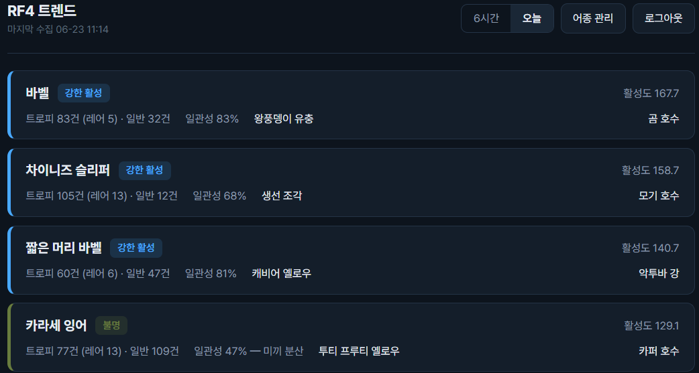
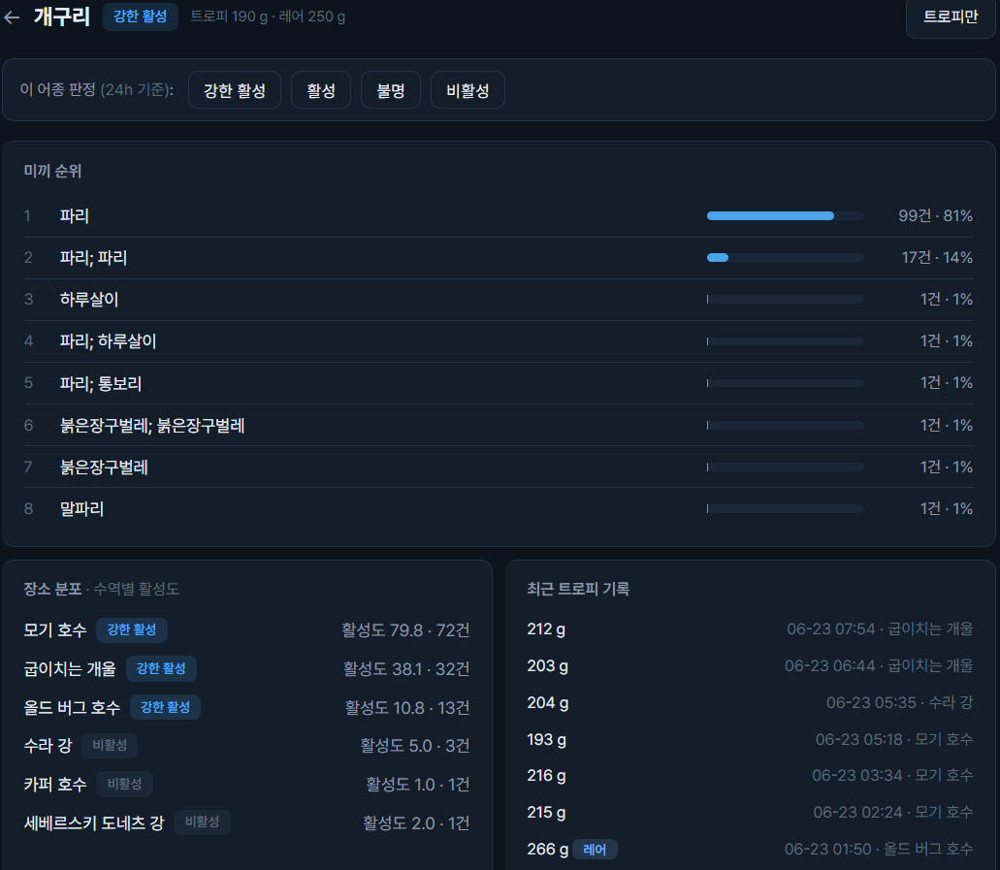

# RF4 트렌드

> 러시안피싱4(RF4) 공식 주간기록을 15분마다 수집·누적해, 등록해 둔 선호 어종의 **활성도**를 접속 즉시 추천하는 개인 대시보드.

[](https://rf4trends.com)


게임 속 주간기록 탑5는 하루에도 여러 번 갈린다. 그 **교체 빈도**가 곧 "지금 그 어종이 잘 잡히는가"의 신호다. RF4 트렌드는 탑5에서 밀려나는 기록까지 빠짐없이 수집·누적해, 내가 노리는 어종이 지금 활성 상태인지 알려준다.

---

## 스크린샷

<!-- 아래 경로에 실제 스크린샷 파일을 넣으세요 (예: screenshots/) -->

**대시보드 — 선호 어종 활성도 순 정렬**



**어종 상세 — 미끼 순위·장소 분포·최근 트로피 기록**



---

## 핵심 설계 포인트

이 프로젝트에서 특히 공들인 부분.

**1. 시간 처리 전면 UTC 통일 (저장·계산은 UTC, 표시만 KST)**
수집 시각을 로컬(KST)로 저장하던 것이 UTC 필터와 9시간 어긋나 '오늘'과 '3일' 탭이 같아지는 버그를 겪었다. 이후 저장·필터·계산을 전부 UTC로 못박고, 사람이 보는 화면만 KST로 변환하는 원칙을 세웠다. 게임 서버(MSK)·표시(KST)·계산(UTC)이 뒤섞이는 혼란을 한 원칙으로 정리.

**2. 라벨 스냅샷 박제 — 미래의 ML 학습을 위한 설계**
활성도를 사람이 4단계(강한활성/활성/불명/비활성)로 라벨링하면, **그 순간의 활성도 지표(등급별 개수, 미끼 일관성, 무게 비율, 리셋 후 경과시간 등)를 함께 박제**한다. 원본 수집 데이터가 7일 후 정리돼도 학습쌍은 영구 보존된다. 이상치 판별에 쓸 정보는 "찍는 순간"에만 박제 가능하다는 판단에서 작성자 권한(source)까지 함께 저장.

**3. 추천 로직의 모듈 분리 — 교체 가능한 설계**
현재 활성도는 임시 수식으로 동작하지만, scoring.py를 독립 모듈로 분리해 향후 ML 모델로 통째로 교체해도 나머지 구조에 영향이 없게 했다. 모델 방향은 트리 기반(LightGBM) 순서형 분류 + 확률 가중 점수로 확정해 둔 상태(라벨 축적 후 적용).

**4. "코드 버그 vs 기능적 문제"의 구분**
개발 중 마주친 이상 현상을 두 갈래로 나눠 다뤘다. 코드가 잘못된 것은 코드로 고치고, 데이터·운영 특성상 생긴 현상(초기 적재로 인한 점수 과대 등)은 코드를 건드리지 않고 원인을 짚었다. 한때 정렬 문제를 코드로 고치려다, 원인이 데이터임을 파악하고 변경을 철회한 사례가 대표적. (자세한 내역은 맨 아래 개발 변천사 참고)

---

## 기술 스택

| 구분 | 사용 |
|------|------|
| 백엔드 | Python 3.12, FastAPI, Uvicorn |
| 템플릿 | Jinja2 |
| 수집 | requests, BeautifulSoup4 |
| 인증 | bcrypt(해시), itsdangerous(서명 세션 쿠키) |
| DB | SQLite (WAL 모드, 런타임 ALTER TABLE 마이그레이션) |
| 배포 | Android 태블릿 + Termux 상시 구동, Cloudflare Named Tunnel |

---

## 구조

```
rf4trends/
├── README.md         # 이 문서 (포트폴리오 + 패치노트)
├── PRD.md            # 제품 요구사항 + 결정 로그
├── EXPERIENCES.md         # 이슈 경험 — 기능 간 상충과 판단의 서사
├── SCREENS.md        # 화면 정의서
├── screenshots/      # 스크린샷
├── rf4site/          # 실제 서비스 (운영에 필요한 핵심 파일만)
│   ├── app.py            # FastAPI 서버 + 15분 수집 스레드 + 하루 1회 정리 (단일 프로세스)
│   ├── collector.py      # 주간기록 파싱·누적 (30개 게시판, 에러 백오프)
│   ├── scoring.py        # 활성도 계산 (교체 가능한 추천 모듈)
│   ├── labels.py         # 라벨 수집 + 활성도 스냅샷 박제
│   ├── auth.py           # 회원 인증 (bcrypt, 서명 세션)
│   ├── maintenance.py    # 7일 초과분 archive.db로 분리
│   ├── trophy_weights.csv# 트로피 기준 251종
│   └── templates/        # base / dashboard / species / login / onboarding
└── tools/            # 개발용 (서비스엔 불필요, 개발·배포 시 사용)
    ├── test_*.py         # 테스트 (app / auth / labels)
    └── TERMUX_SETUP.md   # 배포 가이드
```

---

## 실행 방법

```bash
cd rf4site

# 1. 의존성 설치
pip install -r requirements.txt

# 2. (선택) 환경변수
export RF4_SECRET="세션-서명-키"     # 미설정 시 임시 키
export RF4_ADMIN="admin"            # admin 계정 아이디 (기본 admin)

# 3. 실행 — 웹서버 + 수집 스레드가 한 프로세스에서 동작
python app.py                       # http://0.0.0.0:8000
```

첫 실행 시 빈 DB가 생성되고, 백그라운드 수집 스레드가 15분 주기로 주간기록을 모으기 시작한다. `/signup`으로 계정을 만들고 선호 어종을 등록하면 대시보드에 활성도가 표시된다.

> 수집 첫 3일은 일주일치가 한꺼번에 적재되어 점수가 부풀려질 수 있다(초기 적재 현상, 버그 아님). 72시간 창이 한 바퀴 돌면 정상화된다.

테스트:
```bash
cd tools
python test_app.py && python test_auth.py && python test_labels.py
```

배포(Termux + Cloudflare Named Tunnel)는 [tools/TERMUX_SETUP.md](tools/TERMUX_SETUP.md) 참고.

---

## 데이터 출처

- 주간기록: [rf4game.kr](https://rf4game.kr) (게임 공식)

---
## 개발 변천사 (패치노트)

개발 과정의 시간순 기록. 각 항목을 성격에 따라 분류함.

**분류 범례**
- `[기능추가]` 새 기능. 무엇을, 왜 넣었는지
- `[코드버그]` 코드가 의도와 다르게 작성되어 실제로 잘못 동작한 결함
- `[기능문제]` 코드는 옳으나 데이터·설계 특성상 발생한 현상 (코드 수정 대상 아님)
- `[변경]` 방향 전환·설계 결정·리팩터링
- `[인프라]` 배포·운영 환경

> 코드버그와 기능문제의 구분이 이 문서의 핵심.
> 전자는 코드를 고쳐 해결, 후자는 코드를 건드리지 않고 데이터/운영으로 처리.

---

## 1기 — 기반 구축 (06-12 ~ 06-13)

### 06-12 · 데이터 파이프라인과 초기 설계

`[변경]` **수집 출처를 rf4game.kr로 통일.** 한국어 어종명을 그대로 쓰기 위함. 번역 매핑 불필요.

`[변경]` **수집 범위를 전 지역(10개)으로, 라이트/바텀라이트/해양 카테고리는 제외.** .kr/.com 양쪽을 확인해 통합과 동일 데이터임을 검증한 뒤 결정. 전 지역 유지는 주 후반 표본 편향 완화 목적.

`[기능추가]` **수집기(collector.py) 구현.** 3카테고리 × 10지역 = 30개 게시판 파싱. 중복 키는 (player, species, weight_g, caught_date).
- `[기능추가]` **에러 백오프**: 403/429 응답 시 수집 사이클 즉시 중단 — 차단 방지.
- 수집 주기 15분 결정: 탑5에서 밀려나는 기록을 놓치지 않을 정도의 간격.

`[변경]` **미끼를 색상 코드까지 구분.** 인게임에서 같은 미끼라도 색상별로 전혀 다르게 작용. 표시와 일관성 계산 모두에 적용.

`[변경]` **트로피 기준(251종, trophy_weights.csv)을 사전 추출해 내장.** 어종별 트로피/레어트로피 판정에 사용.

`[변경]` **제품 방향 전환 — 전체 기록 브라우저를 버리고 "선호 어종 대시보드"로 재정의.** 처음엔 전체 기록을 보여주려 했으나, 단순 기록 조회는 차별점 없음으로 판단. 차별점은 "내가 등록한 어종만, 활성도 순으로"라는 개인화. 이 결정이 제품의 핵심 정체성이 됨.

`[변경]` **추천 로직은 임시 수식으로 시작하고, 모듈(scoring.py)을 분리.** 추천 성능은 계속 개선할 대상이므로, 나중에 모델만 갈아끼울 수 있게 경계를 그음. 이 설계가 이후 모든 ML 논의의 전제가 됨.

`[기능추가]` **수집기를 웹서버와 분리된 상시 프로세스로.** 사이트를 안 볼 때도 수집은 계속돼야 탑5에서 밀려나는 기록 포착 가능.

### 06-13 · 회원 시스템과 첫 코드 검수

`[기능추가]` **회원 시스템 도입(auth.py).** 외부 공개 대비. 아이디/비밀번호(bcrypt 해시), itsdangerous 서명 세션 쿠키. favorites 테이블에 user_id 추가해 사용자별 선호 어종 분리.

`[변경]` **첫 코드 검수 반영(D-16).** 문서-코드 동기화, 죽은 코드 제거, SQLite WAL 모드 도입(수집 스레드와 웹 요청의 동시 접근 대비), 빈 온보딩 화면 안내 추가. scoring.py의 f-string SQL에 "사용자 입력은 ? 바인딩, f-string엔 서버 상수만"이라는 안전 규율을 주석으로 명시.

`[변경]` **시간창 기준을 caught_date(날짜) → first_seen(수집 시각) 롤링으로 변경(D-17).** 핵심 통찰: 주간 탑5는 하루에도 여러 번 갈리고, 그 "교체 빈도"가 곧 활성도. 날짜 기준이 아니라 수집 시점 기준 롤링이라 언제 봐도 표본이 꽉 찬 상태 유지. 오늘=24h, 3일=72h. (단, 수집기 가동 중에 갈린 것만 포착되는 원천적 한계가 있어 상시 가동이 전제.)

`[기능추가]` **라벨 수집 기능(labels.py).** 강한활성/활성/불명/비활성 4단계. 향후 추천 모델의 학습/검증 데이터. **핵심 설계 — 라벨을 찍는 순간의 활성도 지표 스냅샷을 함께 박제.** 원본 데이터가 정리돼도 학습쌍이 보존되도록. 같은 어종을 여러 번 라벨하면 새 행으로 누적.

`[기능추가]` **7일 초과분 아카이브(maintenance.py).** 운영 DB는 first_seen 7일 이내만 유지(추천은 최대 72h만 사용). 초과분은 archive.db로 옮긴 뒤 삭제. 모델 향상용으로 과거 데이터는 보존하되 운영 DB는 경량화. users/favorites/labels는 정리 대상에서 제외.

`[기능추가]` **라벨 스냅샷에 무게 비율 통계 추가(D-20).** 등급 3단계(레어/트로피/일반)는 연속적인 무게 정보를 손실시킴. 무게÷기준점 비율(trophy_ratio, rare_ratio의 최대/최소/평균)을 저장해 학습 시 연속 정보 보존. 단 catches엔 저장 안 함 — weight_g에서 유도되는 파생값이라 중복·노후화를 피하고 추출 시 계산.

---

## 2기 — 모델 설계의 정립 (06-13 ~ 06-15)

### 06-13 · 활성도 모델의 근본 재설계

`[변경]` **준트로피(트로피의 70%) 개념 폐기, 모집단을 전체 수집 기록으로 확대(D-21).** 처음엔 "트로피의 70% 이상"을 활성 신호로 봤으나 — 주간기록 등장 자체가 이미 상위권 선별이고, 작은 기록이 갱신 안 되는 것도 비활성의 근거가 됨. 70% 컷은 임의 설정이었음을 인정. 더 근본적으로, 어종마다 활성 기준이 달라(흔한 종 vs 희귀종) 일괄 수식이 부적절함 → species를 피처로 ML이 어종별로 학습하는 방향으로.

`[변경]` **향후 활성도 모델 방향 확정 — 순서형 분류 + 확률 가중 점수(D-22).** 활성 단계를 순서로 봄(비활성0 < 불명1 < 활성2 < 강한활성3). 분류 모델이 각 단계 확률을 출력하면, 단계 표시는 최고 확률 단계로, 활성도 점수는 Σ(단계점수 × 확률) 기댓값으로. 최고확률만 점수로 쓰면 "60% 강한활성 vs 70% 활성" 같은 역전이 생기지만, 기댓값은 단계와 점수가 항상 같은 방향이라 이를 방지.

### 06-14 · 주기성 피처

`[기능추가]` **라벨 스냅샷에 '리셋 후 경과시간'(hours_since_reset, 0~168) 추가(D-23).** 주간 리셋(월 04:00 KST = 일 19:00 UTC) 직후와 주말은 같은 기록 수라도 활성도 의미가 다름 — 주 초반의 적은 기록은 활성 신호지만 주말 누적 후엔 포화. UTC 기준으로 계산해 태블릿 시간대와 무관함. 학습 시 시점 맥락 피처로 사용.

### 06-15 · 권한과 향후 설계 메모

`[기능추가]` **라벨 수집을 admin 전용으로 제한(D-24).** 라벨은 학습 데이터의 정답이라 아무나 찍으면 오염됨. 화면에서 버튼 자체를 숨기고(존재를 모르게) + 서버 API에서 403 차단하는 이중 방어. (환경변수 RF4_ADMIN, 기본 'admin')

`[변경]` **향후 ML 설계 보강 메모(D-25, 코드 변경 없음).** ①희소 어종 문제 — 모든 어종을 라벨할 수 없으니, species를 단일 피처로 둔 단일 모델이면 라벨 적은 어종도 일반 패턴으로 추론. ②하이브리드 옵션 — 라벨 부족한 어종은 수식 폴백, 충분한 어종은 ML. ③미끼 일관성은 로그 형태 비선형일 가능성 — 트리 모델이 자동 학습. ④확신하는 어종만 라벨(애매하면 비워두는 게 데이터 품질에 유리).

`[변경]` **모바일 알림·활성도 공식 전면 개편 보류(D-26).** 임시 수식은 "라벨 찍을 때 화면이 그럭저럭 맞으면" 충분. 어차피 ML로 교체될 코드라 지금 개편은 비효율.

---

## 3기 — 실데이터 진단과 버그 수정 (06-15 ~ 06-16)

> 실제 수집 DB(76,357건)를 받아 진단하면서, 기능문제와 코드버그가 처음으로 명확히 갈린 시기.

### 06-15 · 정렬 문제 — 코드가 아니라 데이터였다

`[기능문제]` **"점수 높은 불명이 활성보다 위에 온다."** 대시보드에서 활성도 점수로 정렬하니, 기록이 많아 점수가 높은 '불명' 어종이 '활성' 어종보다 위로 올라옴.

`[변경→철회]` **처음엔 정렬을 단계 우선 2단계로 바꿔 해결하려 했음(D-27).** 그러나 원인을 추적하니 — 코드 문제가 아니라 **초기 적재 현상**이었음. 그래서 변경을 **철회**하고 점수 단일 기준 정렬로 되돌림. 교훈: 데이터 문제를 정렬 로직 왜곡으로 덮지 않음.

`[기능문제]` **초기 적재 현상(D-28).** 수집 첫날엔 사이트의 일주일치 탑5가 전부 "그 시점"의 first_seen으로 한꺼번에 적재됨 → 시간창과 power가 부풀려짐. **이것은 버그가 아님.** 수집 3일이 지나 72h 창이 한 바퀴 돌면 첫 적재분이 빠지며 정상화됨. 대응: 코드를 고치지 않고, "본격 라벨 수집은 수집 3일 이후 권장"이라는 운영 지침으로 처리.

### 06-16 · 코드버그 2건 — 실제 DB 진단으로 발견

`[코드버그]` **first_seen 시간대 불일치 → '오늘'과 '3일'이 똑같이 표시됨(D-29 ①).**
- **증상**: 오늘(24h) 탭과 3일(72h) 탭의 기록 수가 동일.
- **원인**: collector.py가 `datetime.now()`(태블릿 로컬 = KST)로 first_seen을 저장하는데, scoring.py의 시간창 필터는 SQLite `datetime('now')`(UTC)로 비교. 9시간 차이로 필터 경계가 너무 과거에 잡혀 24h든 72h든 모든 데이터를 포함.
- **수정**: collector를 `datetime.now(timezone.utc)` UTC 저장으로 변경.
- **검증**: UTC 통일 후 카라세가 오늘 177건 / 3일 462건으로 명확히 갈림.
- **파일**: collector.py

`[코드버그]` **미끼 일관성 불일치 — 카드 47% vs 상세 62%(D-29 ②).**
- **증상**: 대시보드 카드의 미끼 일관성과 어종 상세의 1등 미끼 비율이 다르게 표시.
- **원인**: 상세 페이지의 미끼 순위가 `LIMIT 15`로 자른 뒤 그 15개 합을 분모로 비율을 계산. 카라세는 미끼가 88종이라 잘려나간 73종이 분모에서 빠져 1등 비율이 부풀려짐.
- **수정**: 분모를 "시간창 내 미끼 있는 전체 기록 수"로 변경.
- **검증**: 카드 47% = 상세 47%로 일치. 회귀 방지 테스트 추가.
- **파일**: scoring.py

`[변경]` **위 버그로 오염된 데이터 처리.** 기존 first_seen은 KST로 저장돼 있고 초기 적재 오염도 겹쳐 있어, catches/appearances를 초기화하고 재수집. labels/users/favorites는 보존.

`[변경]` **시간 처리 전면 통일(D-30).** D-29의 후속 전수 점검. 원칙을 하나로 못박음 — **저장·필터·계산은 UTC, 사람이 보는 표시만 KST 변환.**
- 최근 트로피 기록을 caught_date(사이트가 주는 MSK 기준이라 혼란) → first_seen(UTC 저장, KST 변환 표시)로 변경.
- 헤더 '마지막 수집'도 KST 변환.
- 하루 1회 정리 판단을 `datetime.now()`(로컬) → UTC로 통일(maintenance의 정리 기준과 일치).
- `_to_kst_str` 헬퍼 추가.
- 결과: caught_date는 더 이상 화면에 표시 안 됨(중복 키로만 사용) → MSK/KST 날짜 혼란 제거.
- **파일**: scoring.py, app.py, templates/base.html, templates/species.html

`[변경]` **향후 모델 선택 확정(D-31).** ①트리 기반 ML(LightGBM) — 표 형태 + 적은 데이터엔 신경망·트랜스포머가 과함(과적합·과복잡). LightGBM은 범주형을 원핫 없이 처리하고 순서형 분류·해석가능·경량. 초기엔 로지스틱 회귀 베이스라인. ②분류로 푼다(회귀 아님) — 라벨이 4단계 이산값이라 회귀는 임의 점수 매핑이 필요. 분류 확률의 가중평균으로 연속 점수를 얻음. ③주기성은 시계열 모델 대신 hours_since_reset 피처로(현재 판정이지 미래 예측이 아니므로). ④species 인코딩은 학습 직전에 적용(현재 문자열 저장이 올바름).

---

## 4기 — 공개 준비와 운영 (06-16 ~ 06-22)

### 06-16 · 라벨 권한 개방 대비 메모

`[변경]` **일반 유저 라벨 권한 개방에 대한 사전 설계(D-32, 당시엔 미구현).** "언젠가" 권한을 풀 경우의 오염 대비책을 정리. 핵심 통찰 — 이상치 판별에 쓸 정보(작성자 구분, 응답시간 등)는 "라벨 찍는 순간"에만 박제 가능하므로 사전에 컬럼을 넣어야 함. admin 라벨을 golden set으로 삼고 일반 유저 라벨을 사후 정제하는 설계.

### UI·표시 개선

`[변경]` **사이트명 'RF4 관제탑' → 'RF4 트렌드'.** 도메인(rf4trends.com)과 통일. 헤더·타이틀·로그인·시작 로그 전부 변경.

`[기능추가]` **무게 표시를 1kg 미만은 g 단위로(_weight_str 헬퍼).** 0.157kg처럼 소수점으로 읽기 어렵던 것을 157g으로. 트로피 기준이 작은 어종(피라미류 등)에서 특히 유용. 최근 트로피 기록과 어종 헤더의 트로피/레어 기준점 양쪽에 적용.

`[변경]` **활성도 단계별 색상을 게임 색감에 맞춤.** 강한 활성 = 파랑(#49A9FF, 레어트로피 색), 활성 = 노랑(#E4C630, 트로피 색), 불명 = 다크 올리브(#687C3E), 비활성 = 회색.

`[변경]` **색상 변수 혼용 정리.** 한 색 변수를 여러 의미로 빌려쓰던 것을 독립 변수로 분리 — `--accent`(UI 강조), `--ok`(성공), `--err`(실패), `--star`(선호 별표), `--warn`(경고). 상태색 변수는 상태 배지·카드 테두리에만 쓰이도록. 각 색이 한 가지 의미만 담당하게 해 향후 색 변경이 다른 곳에 번지지 않게 함.

`[코드버그]` **`--err` CSS 변수 미정의 → 라벨 저장 실패 메시지 색이 안 먹음.**
- **증상**: 라벨 저장 실패 시 메시지가 빨강으로 안 바뀌고 직전 색(성공 초록)이 남아, 실패가 성공처럼 보일 수 있음.
- **원인**: 색상 정리 중 성공색(`--ok`)은 추가했으나 실패색(`--err`)을 base.html `:root`에 빠뜨림. species.html이 `var(--err)`를 쓰는데 정의가 없어 적용 안 됨.
- **수정**: base.html에 `--err:#e0635a;` 추가.
- **파일**: templates/base.html

`[변경]` **기본 시간창을 '3일' → '오늘'로.** 접속 시 첫 화면이 오늘 기준이 되도록.

`[변경]` **코드 검수 반영(소소한 정리).** 죽은 변수(species 컨텍스트의 is_admin) 제거, export_csv에 "수동 추출용" 주석, 미사용 import 제거, total_in_window(이름과 실제 계산이 불일치)를 card.n_total로 대체. — 라벨 권한 토글 항등식은 의도된 스캐폴딩이라 유지.

### 06-20 · 라벨 권한 개방 실행

`[기능추가]` **라벨 권한을 모든 로그인 유저에게 개방(D-33, D-24 해제).** D-32의 대비책을 실제 구현.
- labels 테이블에 source 컬럼('admin'/'user') 추가 — 라벨 작성자의 권한을 박제.
- 기존 DB는 init_db에서 `ALTER TABLE`로 source 컬럼 자동 마이그레이션(옛 라벨은 source=NULL로 보존).
- 권한 조건문 구조는 남김 — 나중에 admin 전용으로 재제한할 때 조건의 `or not is_admin` 부분만 지우면 되도록(API와 화면 양쪽).
- 효과: admin 라벨을 golden set으로, 일반 유저 라벨은 source로 구분해 사후 정제(필터·다수결·모순 탐지) 가능.
- **파일**: app.py, labels.py, templates/species.html

### 06-22 · 도메인 연결

`[인프라]` **Cloudflare Named Tunnel로 rf4trends.com 고정 연결.** 기존 Quick Tunnel은 재부팅마다 주소가 바뀌어 도메인을 붙일 수 없었음. 도메인을 Cloudflare에 등록(네임서버 변경) → Named Tunnel 생성 → config.yml의 ingress로 localhost:8000 연결 → 부팅 스크립트를 `tunnel run`으로 교체. 재부팅해도 주소 고정.
- **트러블슈팅**: config.yml을 잘못된 위치에 둬서 "No ingress rules" 503 발생 → `~/.cloudflared/config.yml`에 정확히 배치해 해결.

### 06-22 · 미끼 분석용 보관 구조

`[변경]` **7일 초과분 보관 방식을 미끼 분석 전용으로 교체(D-34).** 기존에는 7일 초과 catches를 archive.db에 전체 컬럼 그대로 복사했으나 — 보관의 실제 용도가 미끼·무게 분석임을 고려해, 어종·미끼·무게만 남기는 bait_records 테이블로 변경.
- 장소·시각·플레이어는 미끼 분석에 불필요하므로 버려 용량 절감.
- 미끼는 원본 그대로 보관. RF4는 채비에 미끼를 최대 2종까지 달 수 있어 "꿀 반죽; 옥수수씨"처럼 세미콜론으로 묶여 들어오며, 이 조합 정보가 분석 대상.
- 기록별 보관(집계 아님)이라 무게 분포까지 분석 가능. 미끼 없는 기록은 보관에서 제외(분석 의미 없음), 단 운영 DB 삭제는 전건 수행.
- 가능해진 분석: 미끼별 평균/분포 무게, 어종별 미끼 사용 빈도, 미끼 2종 조합 연관성.
- 운영 DB(rf4.db)의 기존 구조는 변경 없음 — archive.db에 테이블이 추가되는 형태.
- **파일**: maintenance.py

### 06-22 · 수역별 활성도 독립 집계

`[변경]` **활성도를 수역(낚시터)별로 따로 집계하도록 변경(D-35).** 같은 어종이라도 수역마다 먹는 미끼가 다름. 예: 바벨이 곰 호수·엠버 호수·카퍼 호수에 모두 등장하는데, 곰 호수에선 특정 미끼로 잘 잡혀도 다른 수역의 제각각인 미끼 데이터까지 한 덩어리로 합쳐지면 미끼 일관성이 희석되어 활성도가 낮게 잡혔음.
- **해결**: `score_species`가 수역별로 따로 점수를 내고, 가장 활성도 높은 수역을 그 어종의 대표값으로 사용. 게임이 수역별로 독립적으로 돌아가므로 합칠 이유가 없음.
- 표본·일관성·상태 판정을 전부 수역 단위로. 모든 수역이 표본 미달이면 그냥 비활성 — 전체 합산으로 보정하지 않음(자의적 데이터 왜곡 방지).
- 점수 계산 로직을 `_score_from_rows`로 분리해 수역별 재사용.
- **화면**: 대시보드 카드는 점수 아래에 대표 수역을 표시, 어종 상세의 장소 분포에는 수역별 활성도 점수·상태 배지를 추가.
- **파일**: scoring.py, templates/dashboard.html, templates/species.html

이 변경은 게임 도메인에 대한 이해(수역별 독립 시스템)에서 나온 설계 개선으로, 단순 합산이 만드는 통계적 왜곡을 제거한 사례.

### 06-22 · 시간창 재조정 (6시간 / 24시간)

`[변경]` **시간창을 24시간/3일에서 6시간/24시간으로 변경(D-36).** 실사용 결과 3일 창은 거의 쓰지 않고 24시간 위주로 보게 됨. 활성도는 "지금 잘 잡히나"가 핵심이라 더 짧은 창이 변화에 민감하게 반응함.
- 6시간 채택 근거: 실제 수집 DB(약 9.8만 건)를 분석해, 6시간 창에서도 어종+수역 조합의 80%가 표본 충분(당시 임시 기준 MIN_SAMPLE=5)함을 확인. 24시간(85%)과 큰 차이가 없어 6시간이 민감도·표본 균형에서 적합.
- 기본 탭은 24시간 유지. 표본이 적을 때는 6시간→24시간으로 넓히도록 안내.
- **파일**: scoring.py(WINDOWS), app.py(기본값), templates/base.html(탭), templates/dashboard.html·species.html(안내 문구)

### 06-23 · 시간창 필터 버그 (T vs 공백 구분자)

`[코드버그]` **시간창 탭(6h/24h)을 눌러도 표시 데이터가 안 바뀌는 버그.**
- **증상**: 6h와 24h 탭을 번갈아 눌러도 같은 데이터가 표시됨. 실제로는 한 어종에서 6h=249건, 24h=249건처럼 동일하게 나왔음.
- **원인**: collector가 first_seen을 `isoformat`의 **T 구분자**(`2026-06-22T13:00`)로 저장하는데, SQLite `datetime('now')` 경계는 **공백 구분자**(`2026-06-22 13:00`)임. SQLite에서 이 둘을 문자열로 비교하면 `'T'`(ASCII 84) > `' '`(ASCII 32)라, 같은 날짜 안에서 시간 비교가 깨져 시간창 필터가 무력화됨. 6h든 24h든 모든 기록이 경계를 통과해 버림.
- **근본 해결**: 비교할 때마다 `datetime()`으로 감싸 정규화하는 방법(반창고)도 가능했으나, 모든 쿼리에 변환을 덧대면 코드가 지저분해지고 같은 실수가 재발하기 쉬움. 대신 **데이터와 저장 포맷 자체를 통일**함 — collector 저장을 SQLite와 동일한 공백 구분자로 바꾸고, 기존 T 데이터는 한 번의 `REPLACE` UPDATE로 정리. 비교 쿼리는 원래의 깔끔한 `c.first_seen >= ...` 형태를 유지.
- 일회성 데이터 정리는 단일 운영 환경(태블릿 1대)이라 코드에 마이그레이션을 박지 않고 터미널에서 수동 1회 실행 — 정리되면 끝나는 작업을 영구 코드로 남기지 않음.
- **검증**: 실제 수집 DB(약 8.8만 건)를 공백으로 통일한 뒤, 반창고 없는 코드로 6h≠24h가 정확히 갈리는 것을 확인. 회귀 방지 테스트는 공백 포맷 기준으로 작성해 실행 시각과 무관하게 안정적이도록 함.
- **파일**: collector.py(저장 포맷), scoring.py·maintenance.py(비교 복원), test_app.py(회귀 테스트)

이 버그는 "코드 버그(문자열 비교 결함)"이면서, 해결 방식에서 **반창고(임시 변환)와 근본 해결(데이터 통일)의 차이**를 보여주는 사례. 더 적은 코드로 더 깨끗하게 끝내는 쪽을 택함.

### 06-23 · 어종 상세 교차 필터링

`[기능추가]` **어종 상세창에 교차 필터링(cross-filtering) 도입(D-38).** 미끼 순위·장소 분포·트로피 기록 세 블록이 서로를 필터링함.
- 수역 클릭 → 그 수역에서 나온 미끼·트로피만 / 미끼 클릭 → 그 미끼가 어느 수역에서 나왔는지 분포·트로피 / 같은 항목 재클릭 → 해제.
- 동기: 수역별로 활성도를 따로 매기게 됐는데(D-35), 상세창은 여전히 전체 통합 데이터만 보여줘 "어느 수역의 어떤 미끼가 잘 먹히는지"를 좁혀볼 수 없었음. 교차 필터링으로 한 화면에서 수역·미끼·트로피를 자유롭게 가로질러 탐색.
- **trophy_only 토글 유지**: 교차 필터(좁히기)와 축이 다른 기능 — 현재 보는 범위의 등급 분포·추세 파악용. 교차 필터와 독립적으로 AND 결합됨.
- **구현 방식**: 서버는 시간창 내 원본 기록 배열을 JSON으로 넘기고(집계 안 함), 클라이언트 JS가 미끼/장소/트로피를 직접 집계·필터·재집계. 단 활성도 점수(score/state)는 임시 수식이라 서버가 수역별로 계산해 넘김 — ML 교체 시 서버만 고치면 되도록 점수 로직을 JS에 중복시키지 않음. trophy_only도 서버 URL 파라미터에서 클라이언트 토글로 이전.
- 가·나·다(수역/미끼/트로피 필터)를 "필터 1개 + 나머지 재집계"하는 단일 구조로 한 번에 구현해, 분기마다 로직이 갈리는 걸 방지.
- **파일**: scoring.py(원본 records·수역별 점수 반환), app.py(trophy_only 파라미터 제거, tojson 한글 설정), templates/species.html(JS 교차 필터링 전면 재작성)

### 06-23 · 디렉토리 구조 재정리

`[변경]` **저장소를 독자 기준으로 3분할(D-39).** 루트 아래 `rf4site/`(실제 서비스 핵심만), `tools/`(개발용), `screenshots/`(소개용), 그리고 루트에 포트폴리오·기획 문서(README·PRD·SCREENS).
- `rf4site/` — 운영에 필요한 파일만: app·collector·scoring·labels·auth·maintenance·templates·trophy_weights.csv
- `tools/` — 서비스엔 불필요하지만 개발·배포에 쓰는 것: 테스트 3종, TERMUX_SETUP(배포 가이드)
- 테스트를 tools로 옮기면서 `sys.path`에 rf4site를 추가하고, `RF4_DB` 환경변수로 app과 같은 DB를 참조하도록 격리. app.py는 DB 경로를 환경변수로 받게 하되 미설정 시 기존 경로라 운영엔 영향 없음.
- 효과: 저장소를 처음 보는 사람이 "무엇이 서비스이고, 무엇이 개발 도구이고, 무엇이 소개인지"를 폴더만 보고 바로 구분.

### 06-24 · 라벨 수집을 수역별로 분리

`[기능추가]` **라벨 스냅샷을 "한 수역 = 한 스냅샷"으로(D-40).** 어종 상세 판정 섹션이 이제 수역과 연동됨.
- 수역이 한 곳뿐이면 판정 섹션이 자동으로 그 수역으로 활성화. 여러 곳이면 장소 분포에서 수역을 선택해야 활성화되고(미선택 시 흐릿 + 안내문구), 선택한 그 수역만 스냅샷에 담김.
- 동기: D-35(수역별 독립 집계) 이후 라벨 스냅샷에 남아있던 정합성 문제 — 점수(score)는 대표 수역 기준인데 미끼 비율(ratio_stats)은 전체 수역 통합이라, 한 라벨 안에 기준이 다른 두 값이 섞여 있었음. 사후에 값을 맞추는 대신, 둘 다 사용자가 고른 같은 한 수역만 보고 계산하게 만들어 섞일 여지 자체를 없앰.
- **구현**: `scoring.score_species_at(conn, species, window, waterbody)` 신규(기존 `score_species`는 대시보드용으로 그대로 유지), `ratio_stats`에 `waterbody` 인자 추가. `/api/label`에 `waterbody` 필수 파라미터, 해당 수역에 기록 없으면 400. 스키마 변경 없음 — 기존 `top_waterbody` 컬럼이 "라벨한 수역"을 그대로 담음.
- **파일**: scoring.py(score_species_at·ratio_stats), app.py(/api/label), templates/species.html(라벨 패널 활성화 JS), tools/test_labels.py(수역별 격리 회귀 테스트)

### 06-27 · 장소 분포 필터를 옵션버튼 방식으로

`[변경]` **어종 상세 '장소 분포' 필터를 라디오(옵션버튼) 방식으로 변경(D-41).** 수역을 클릭하면 그 수역만 강조하되 다른 수역은 목록에 그대로 남김.
- 기존엔 수역 선택 시 다른 수역이 목록에서 숨겨져, 전환하려면 매번 해제 후 다시 선택해야 했음. 이제 목록은 전체 수역을 유지하고 선택만 강조 — 다른 수역을 누르면 바로 그쪽으로 전환, 선택된 수역 재클릭 시 해제. 수역 목록이 짧아 한눈에 빠르게 전환 가능.
- 장소 분포에만 적용. 미끼 순위는 종류가 많아 기존처럼 선택 시 다른 미끼를 숨기는 방식 유지, 트로피 기록도 교차필터 유지.
- **구현**: `filteredForPlaces()` 신규 — `filtered()`와 같되 자기 축인 수역 필터만 빼고 트로피토글·미끼·트로피기록 필터는 동일 적용. `render()`에서 장소 블록만 이 집합을 받음(미끼·트로피 블록은 `filtered()` 그대로). 라디오 전환·재클릭 해제는 기존 `toggleFilter` 로직 재사용 — '숨김'처럼 보이던 건 장소 목록이 수역 필터된 집합을 받았기 때문.
- **파일**: templates/species.html

### 06-27 · 활성도 분류를 ML 모델로 교체

`[변경]` **라벨 4단계 중 '불명'을 '가능성'으로 이름 변경(D-42).** "확실히 활성화된 정도는 아니나 탐색해볼 가치가 있는 가능성"이라는 의미가 더 명확함.
- labels.py VALID_LABELS, scoring.py STATE_UNCLEAR→STATE_POSSIBLE, 템플릿 표시 문구·매핑 전부 수정. 운영 DB의 기존 '불명' 라벨은 수동 1회 마이그레이션으로 안내(`UPDATE labels SET label='가능성' WHERE label='불명'`).

`[변경]` **활성도 분류를 임시 선형 수식에서 RandomForest 분류 모델로 교체(D-43).** 기존 `power = n_rare*3+n_trophy*2+n_normal*1; score = power*consistency` + 하드코딩 임계값 방식을 사람이 직접 찍은 라벨 381건으로 학습한 모델로 대체.
- 평가: 다수클래스 베이스라인 33% 대비 정확도 64%, 인접(±1)정확도 97% — 신호 확인 후 반영.
- **태블릿 제약**: Termux(ARM)는 TUR 저장소에 scikit-learn 패키지가 없어 `pkg install`로 설치 불가능, `pip` 소스빌드도 Cython·C++ 컴파일러가 필요해 비현실적. 그래서 학습은 PC(tools/train_model.py, 전용 가상환경)에서만 하고, 학습된 트리를 순수 파이썬 데이터(`rf4site/model_data.json`)로 export — 태블릿은 표준 라이브러리만 쓰는 `rf4site/model.py`로 추론한다. 운영 requirements.txt 변경 없음.
- RandomForest를 고른 이유는 export 단순함. 트리 하나하나가 단순 배열(분기 노드의 feature·threshold·children, 리프의 클래스 확률)이라 순수 파이썬 순회만으로 추론 가능. HistGradientBoosting도 평가했으나(정확도 65%, 거의 동등) softmax 등 내부 구조가 복잡해 export가 번거로워 채택 안 함.
- 점수는 D-22가 설계해둔 확률가중 기댓값(클래스별 확률 × 단계 점수의 합)을 0~100 스케일로 변환해 처음 구현됨. 표본 미달(MIN_SAMPLE=5 미만)은 모델을 호출하지 않고 바로 비활성 처리 — 합산 보정 없이 그냥 비활성으로 두는 원칙(D-35) 유지.
- **파일**: rf4site/model.py(신규, 순수 파이썬 추론), rf4site/model_data.json(신규, 모델 아티팩트), rf4site/scoring.py(`_score_from_rows`를 모델 호출로 교체, `_trophy_thresholds`·`_ratio_from_rows` 헬퍼 분리), rf4site/labels.py, templates/{dashboard,species,base}.html, tools/train_model.py(신규, PC 학습용), tools/train_eval.py(신규, 평가 실험용), tools/requirements-ml.txt(신규), tools/test_app.py(모델 스텁으로 파이프라인 검증 + 실제 모델 아티팩트 적재 점검 추가), .gitignore(`*.json` 규칙에 model_data.json 예외 추가)

`[변경]` **D-42의 '가능성'을 '탐색'으로 재변경(D-44).** "확실히 활성은 아니나 가볼 만한 가치가 있다"는 의미를 '탐색'이 더 잘 전달함. labels.py·scoring.py·templates·tools 전체에서 일관 변경.

---

## 부록 — 운영 환경

- **런타임**: 안드로이드 태블릿(레노버, Dimensity 6300/6GB), Termux 상시 구동
- **공개**: Cloudflare Named Tunnel → rf4trends.com
- **DB**: SQLite (런타임 `ALTER TABLE` 마이그레이션 패턴), WAL 모드
- **스택**: FastAPI, Jinja2, BeautifulSoup, bcrypt, itsdangerous

## 부록 — 코드버그 vs 기능문제 요약

| 구분 | 사례 | 처리 |
|------|------|------|
| 코드버그 | first_seen KST 저장 vs UTC 필터 (오늘=3일) | collector UTC 저장으로 수정 |
| 코드버그 | 미끼 일관성 분모가 LIMIT 15 합 (47% vs 62%) | 분모를 전체 미끼 기록 수로 수정 |
| 코드버그 | --err CSS 변수 미정의 (실패가 성공처럼 보임) | base.html에 변수 추가 |
| 코드버그 | first_seen T 구분자 vs SQLite 공백 구분자 → 시간창 필터 무력화 (6h=24h) | 저장 포맷 공백 통일 + 기존 데이터 1회 정리 |
| 기능문제 | 점수 높은 불명이 활성보다 위 | 정렬 로직 안 고침 (원인은 초기 적재) |
| 기능문제 | 초기 적재로 power 부풀려짐 | 코드 안 고침, 3일 후 자연 정상화 |

세 개의 코드버그는 전부 코드를 고쳐 해결했고, 두 개의 기능문제는 코드를 건드리지 않고 원인(데이터·운영)을 짚어 다뤘다. 특히 정렬 문제는 한때 코드로 고치려다 철회한 사례로, 둘의 구분이 실제 의사결정에 작용했음을 보여준다.
